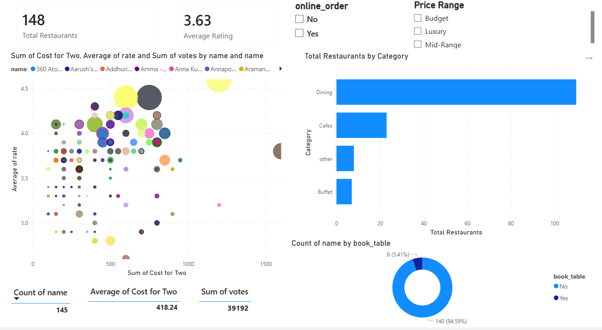

# Zomato Data Analysis & BI Dashboard 📊

> **Problem Statement:** How can restaurant-goers and food-tech companies identify quality restaurants at different price points — and what patterns drive user engagement in the food service industry?

This project delivers a two-phase analytical solution: **Python-based EDA** for data cleaning and exploration, followed by an **interactive Power BI dashboard** for business intelligence and storytelling.

---

## 🧠 Key Business Insights

- 🍽️ **Online ordering drives visibility** — Restaurants offering online orders received significantly higher review volumes and votes, confirming delivery as a key growth lever in the food-tech space
- 💎 **Hidden Gems exist** — A cluster of restaurants rated >4.0 with average cost for two below ₹300 were identified, offering high quality at budget-friendly prices
- ☕ **Cafés outperform Dining** — Café-category restaurants scored higher average user ratings compared to standard Dining outlets, signalling a consumer shift toward quality casual experiences
- 👑 **Luxury drives engagement** — Despite being a small percentage of total restaurants, the Luxury segment drives a disproportionately high share of user votes (a Pareto-style pattern)
- 📋 **Table booking = quality signal** — Restaurants offering table booking showed a positive correlation with higher average user ratings

---

## 🛠️ Tech Stack

| Layer | Tools |
|---|---|
| Data Cleaning & EDA | Python (Pandas, Matplotlib, Seaborn) |
| Environment | Google Colab (Jupyter Notebook) |
| Business Intelligence | Power BI (DAX, Power Query) |
| Data Source | Zomato Restaurant Dataset (CSV) |

---

## 🚀 Project Workflow

### Phase 1 — Python EDA (Google Colab)

- **Data Wrangling:** Handled missing values, parsed currency strings into integers, and normalized ratings to a uniform 5-point decimal scale
- **Correlation Analysis:** Identified a positive correlation between "Book Table" availability and higher average user ratings
- **Visual Exploration:** Used Seaborn and Matplotlib to chart rating distributions, cost patterns, and category breakdowns

### Phase 2 — Power BI Dashboard

- **ETL:** Cleaned data piped from Python into Power Query; applied conditional columns for Price Range segmentation (Budget / Mid-Range / Luxury)
- **DAX Measures:** Built custom weighted rating and popularity index measures for dynamic KPI tracking
- **Interactive Slicers:** Enabled filtering by Online Order availability, restaurant type, and price range
- **Scatter Plot — Hidden Gems:** Visual identification of high-rating, low-cost restaurants for value-for-money analysis

---

## 📊 Dashboard Preview



> 💡 **Executive Metrics tracked:** Total Restaurants · Average Rating (3.63/5) · Average Cost for Two (₹418)

---

## ✅ Skills Demonstrated

`Python` · `Pandas` · `Matplotlib` · `Seaborn` · `Power BI` · `DAX` · `Power Query` · `ETL` · `EDA` · `Data Cleaning` · `Data Visualization` · `Business Intelligence` · `Jupyter Notebook` · `Google Colab`

---

## 📁 Repository Structure

```
├── Zomato_Data_Analysis.ipynb   # Python EDA notebook (Google Colab)
├── Zomato-data-.csv             # Raw dataset
├── cleaned_data.csv             # Processed dataset used for dashboard
├── Zomato Data Analysis.pbix    # Power BI source file
└── Dashboard_preview.png        # Dashboard screenshot
```

---

## ▶️ How to Use

1. **Clone the repo**
   ```bash
   git clone https://github.com/mitalikhot/Zomato-Data-Analysis.git
   ```
2. **EDA Notebook** — Open `Zomato_Data_Analysis.ipynb` in Google Colab or Jupyter to view data processing and analysis
3. **Power BI Dashboard** — Open `Zomato Data Analysis.pbix` in [Power BI Desktop](https://powerbi.microsoft.com/desktop/) to interact with the full dashboard

---

## 👩‍💻 Author

**Mitali Khot**
🔗 [GitHub Profile](https://github.com/mitalikhot) · [Project Repository](https://github.com/mitalikhot/Zomato-Data-Analysis)

---

*⭐ If you found this project helpful, consider starring the repo!*
